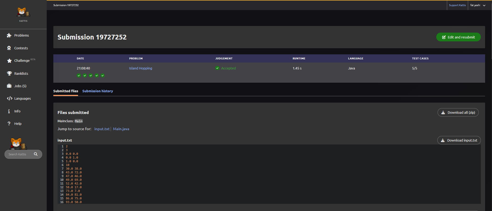
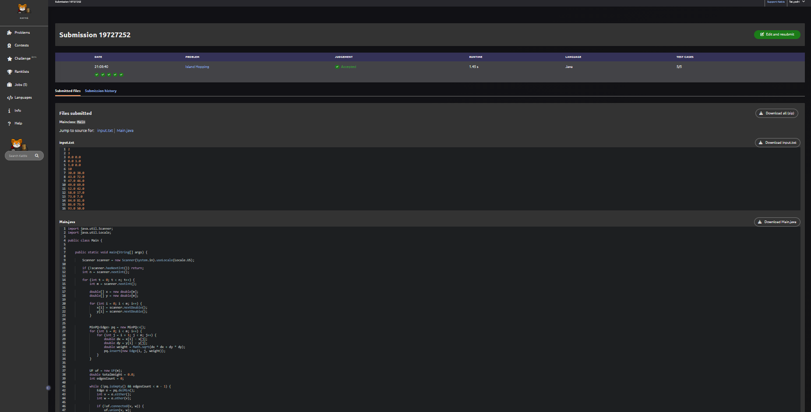

## Nome do Problema
Island Hopping

## Link do Problema
https://open.kattis.com/problems/islandhopping

---

## Integrantes do Grupo
- João Miguel Drumond
- Marina Maia
- Tales Pimentel 

---

## Linguagem Utilizada
- Java

---

# Como Executar a Solução

## Compilar
```bash
javac IslandHopping.java
```

## Executar
```bash
java IslandHopping
```

---

# Entrada de Exemplo

```text
2
3
0.0 0.0
0.0 1.0
1.0 0.0
10
30.0 38.0
43.0 72.0
47.0 46.0
49.0 69.0
52.0 42.0
58.0 17.0
73.0 7.0
84.0 81.0
86.0 75.0
93.0 50.0
```

# Saída Esperada

```text
2.000000000000
218.393430703341
```

---

# Explicação da Modelagem

O problema pode ser modelado como um grafo completo ponderado:

- Cada ilha representa um vértice.
- Cada possível conexão entre duas ilhas representa uma aresta.
- O peso da aresta é a distância euclidiana entre as ilhas.

O objetivo é conectar todas as ilhas com o menor custo total possível.

Para resolver isso, foi utilizada uma Árvore Geradora Mínima (Minimum Spanning Tree - MST).

A distância entre duas ilhas é calculada utilizando:

\[
d = \sqrt{(x_1 - x_2)^2 + (y_1 - y_2)^2}
\]

---

# Algoritmo Utilizado

Foi utilizado o algoritmo de Kruskal para encontrar a MST.

## Funcionamento

1. Ler todas as coordenadas das ilhas.
2. Criar todas as arestas possíveis entre os pares de ilhas.
3. Calcular o peso de cada aresta usando distância euclidiana.
4. Inserir todas as arestas em uma fila de prioridade mínima.
5. Remover sempre a aresta de menor peso.
6. Verificar se a aresta gera ciclo utilizando Union-Find.
7. Caso não gere ciclo, adicionar a aresta à solução.
8. Repetir até conectar todas as ilhas.

---

# Estruturas de Dados Utilizadas

## Edge
Classe responsável por representar uma aresta:
- vértice origem;
- vértice destino;
- peso.

## MinPQ
Fila de prioridade mínima implementada utilizando Heap Binário.

Responsável por:
- armazenar as arestas;
- retornar sempre a aresta de menor peso.

## UF (Union-Find)
Estrutura utilizada para:
- verificar conectividade;
- evitar ciclos.

A implementação utiliza:
- compressão de caminho;
- união por rank.

---

# Análise de Complexidade

Considere:

- \(m\) = número de ilhas.

## Construção do Grafo

Como o grafo é completo, o número de arestas é:

\[
\frac{m(m-1)}{2}
\]

Portanto:

\[
O(m^2)
\]

---

## Inserção na Fila de Prioridade

Cada inserção possui custo:

\[
O(\log E)
\]

Como existem:

\[
E = O(m^2)
\]

A complexidade total é:

\[
O(m^2 \log m)
\]

---

## Operações do Union-Find

As operações possuem custo amortizado praticamente constante:

\[
O(\alpha(m))
\]

onde \(\alpha\) é a função inversa de Ackermann.

---

# Complexidade Final

A complexidade dominante do algoritmo é:

\[
O(m^2 \log m)
\]

---

# Comprovação de Accepted


```md

```

```md


```
